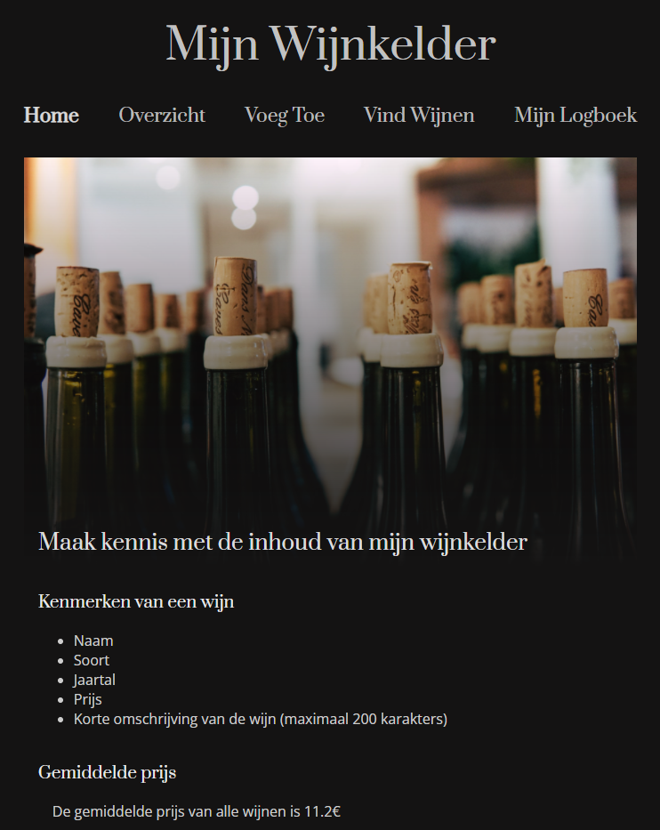

# Wijnkelder - Wine cellar

A Java webapplication for a wine collection.

### Homepage
Calculation of the current average price of the collection.

### Overview
An overview of all the bottles in the collection. Delete a wine by clicking the X button.

### Add a wine
A form to add a wine to the collection. This has input validation.

### Search
Search the collection on year.

### Logbook
User activity is logged using user sessions.

